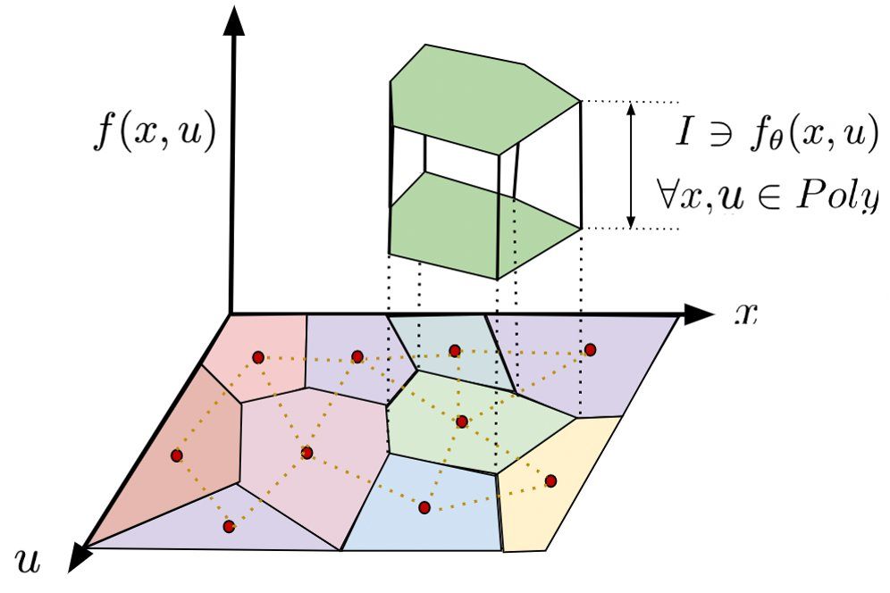
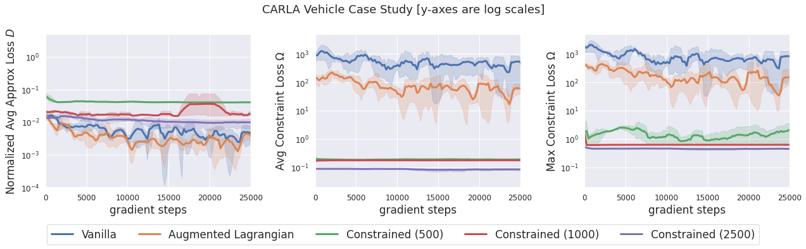
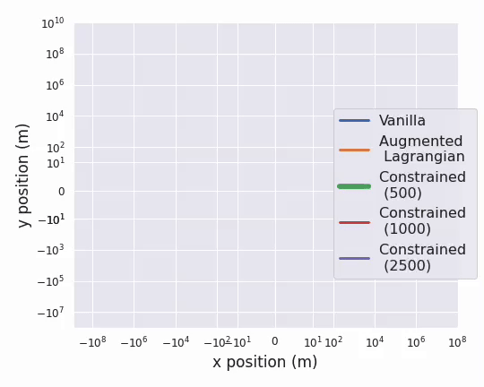
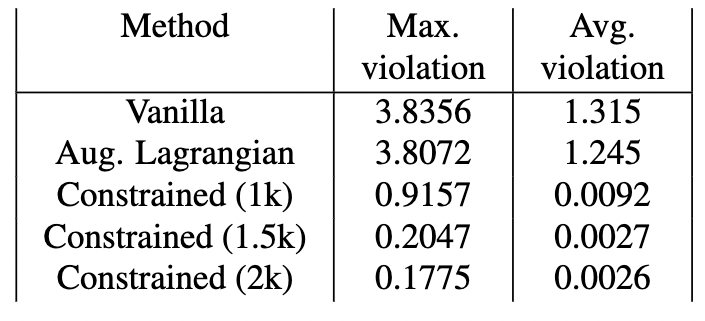

# Guaranteed Conformance of Neurosymbolic Models to Natural Constraints (ENFORCER)
This repository contains the code for the paper available at https://arxiv.org/abs/2212.01346.

<center></center>

Our constrained neurosymbolic models outperform the Vanilla and Augmented Lagrangian methods with guarantees on conformance to natural constraints in three case studies
* **CARLA** -- Conformance of a vehicle model to unicycle dynamics with emphasis on no drift at-rest.

|  | 
|:--:| 
| *Overall conformance to unicycle model:* Constrained models obtain similar or slightly worse approximation error (expected in light of Theorem 6) but 3 orders-of-magnitude reduction in constraint loss. |
|  | 
| *Analysis of model predictions at-rest:* Augmented Lagrangian and Vanilla methods predict that a car starting from the origin at rest will drift when given zero control inputs. Constrained models accurately predict little to no movement. |

* **Artificial Pancreas (AP)** -- Conformance of AP models to ARMAX model that encodes increasing insulin-decreases glucose constraint.

|  | 
|:--:| 
| *Overall conformance to ARMAX model:* Constrained models obtain slightly higher approximation error (expected in light of Theorem 6) but 2 orders-of-magnitude reduction in constraint loss. |
|  | 
| *Delta-monotonicity Analysis:* Augmented Lagrangian and Vanilla methods, unlike Constrained models, violate "increasing insulin, decreases glucose" constraint. |

* **PyBullet Drones** -- Conformance of drone models to quadrotor dynamics with emphasis on hover.
See our paper for the complete set of results.

# Data and Models
The processed data and trained models can be found inside each case study's directory at [this drive folder](https://drive.google.com/drive/folders/1L-aX46Xpkj7-1dps8lGuwRSAbENTX3lD?usp=sharing).

The raw data is also available inside each case study's directory at [this drive folder](https://drive.google.com/drive/folders/1mBGhZE1qdIXdwtYmAOgHUMsdHiW0YbxP?usp=sharing).

Alternatively, the instructions to collect all data and train the ARMAX constraint model specifically for AP can be found at [README_for_Data_Collection.md](README_for_Data_Collection.md).

# Training Constrained Neural Network Dynamics Models
Setup conda env:
```
conda create -n DL_env python=3.8
conda activate DL_env
conda install pytorch torchvision torchaudio pytorch-cuda=11.7 -c pytorch -c nvidia
pip install neupy scipy pybullet
```

Train vanilla and constrained neural network dynamics models as follows where NAME_OF_ENV can be one of {Carla, Drones, AP, Quadrupeds}
```
cd scripts
bash run_Vanillas.sh
bash run_{NAME_OF_ENV}.sh
```

AP delta monotonicity analysis
```
bash run_delta_monotonicity.sh
```

Carla prediction drift analysis
```
bash run_test_at_rest.sh
```

Some helpful information
* [scripts/train.py](scripts/train.py) is the main file. All the bash files above call this file with different arguments. If loading data and models from the drive link above, set [--only_eval](scripts/train.py#L30).
* [scripts/dataset.py](scripts/dataset.py) contains all dataset classes to both load labelled D datasets and create unlabelled \Omega datasets. These classes also [create memories](scripts/dataset.py#L463) (via neupy's neural gas) in the input space. And [compute all lower and upper bounds for each voronoi cell](scripts/dataset.py#L496) in the input space (where each cell corresponds to one memory).
* [scripts/model.py](scripts/model.py) contains the models and trainers. The trainers contain the [symbolic wrapper](scripts/model.py#L118) around the neural network. The [loss function](scripts/model.py#L141) can be augmented lagrangian or simple MSE.
