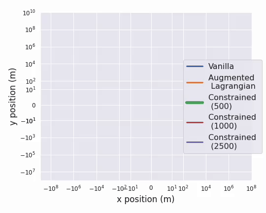

# Guaranteed Conformance of Neurosymbolic Models to Natural Constraints
This repository contains the code for the paper available at https://arxiv.org/abs/2212.01346.

Our constrained neurosymbolic models outperform the Vanilla and Augmented Lgarnagina methods with guarantees on conformance to natural constraints in three case studies
* CARLA -- Conformance of a vehicle model to unicycle dynamics with emphasis on no drift at-rest.
* Artificial Pancreas (AP) -- Conformance of AP models to ARMAX model that encodes increasing insulin-decreases glucose constraint.
* PyBullet Drones -- Conformance of drone models to quadrotor dynamics with emphasis on hover.

|  | 
|:--:| 
| *Augmented Lagrangian and Vanilla methods predict that a car starting from the origin at rest will drift when given zero control inputs. Constrained models accurately predict little to no movement.* |

|  | 
|:--:| 
| *Augmented Lagrangian and Vanilla methods, unlike Constrained models, violate "increasing insulin, decreases glucose" constraint.* |


# Data and Models
The instructions to collect data and train the ARMAX constraint model for AP can be found at [README_for_Data_Collection.md](README_for_Data_Collection.md).

Alternatively, the processed data and trained models can be found inside each case study's directory at [this drive folder](https://drive.google.com/drive/folders/1L-aX46Xpkj7-1dps8lGuwRSAbENTX3lD?usp=sharing).

The raw data is also available inside each case study's directory at [this drive folder](https://drive.google.com/drive/folders/1mBGhZE1qdIXdwtYmAOgHUMsdHiW0YbxP?usp=sharing).

# Training Constrained Neural Network Dynamics Models
NAME_OF_ENV can be one of {Carla, Drones, AP, Quadrupeds}
```
bash run_Vanillas.sh
bash run_{NAME_OF_ENV}.sh
```

AP delta monotonicity analysis
```
bash run_delta_monotonicity.sh
```

Carla prediction drift analysis
```
bash run_test_at_rest.sh
```
